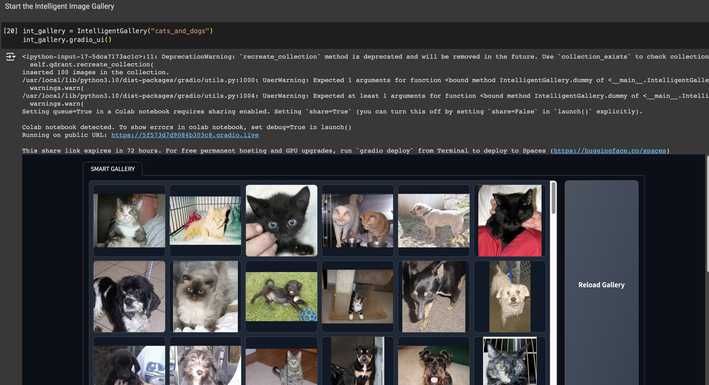
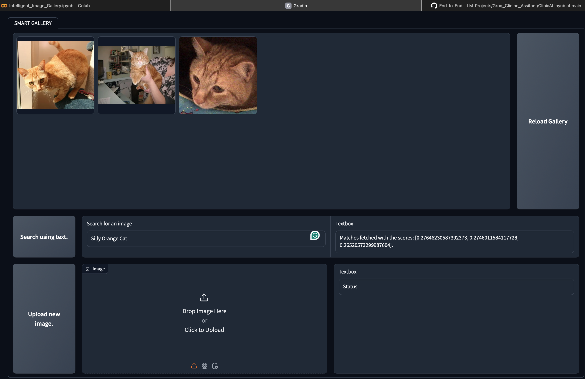
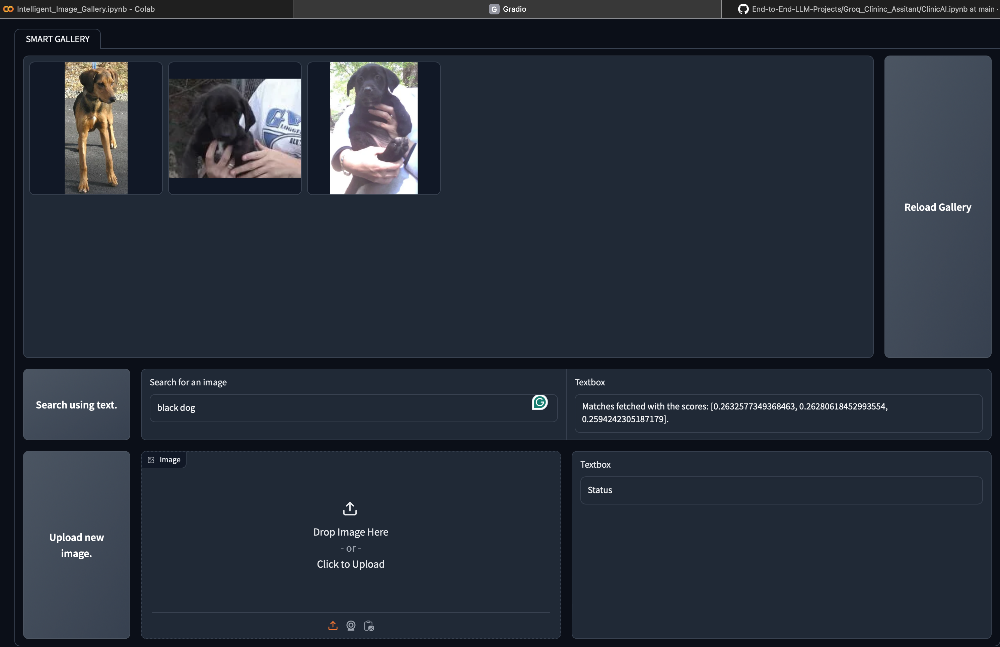
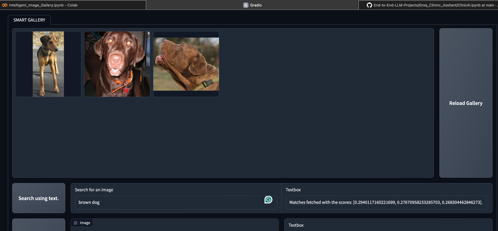
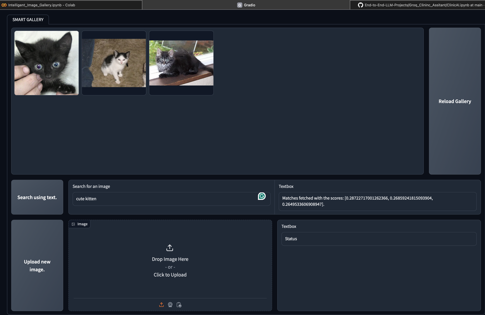
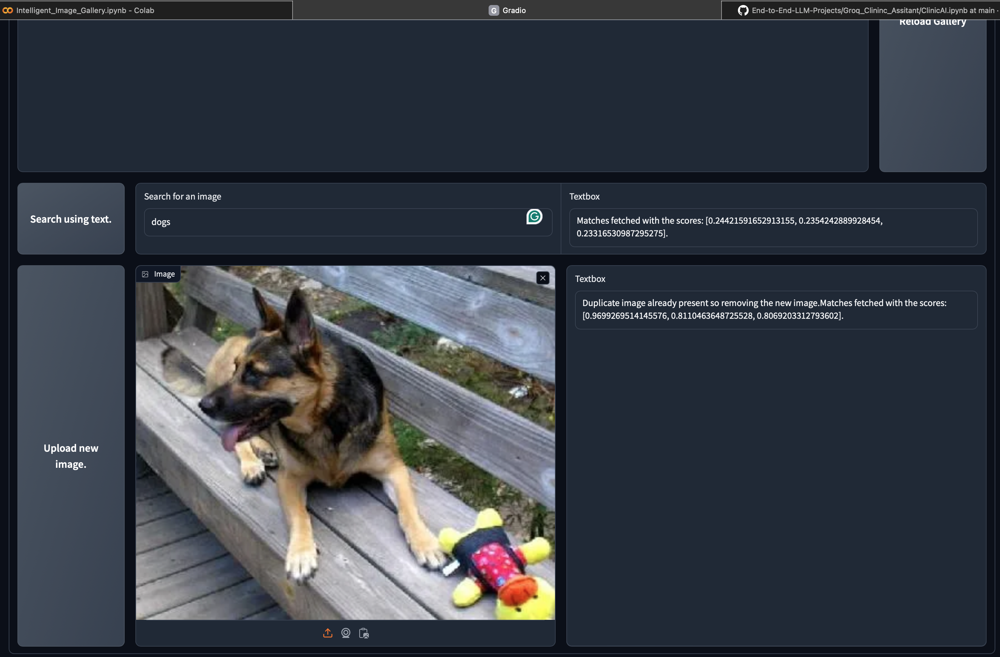

# Intelligent Image Gallery with Uploads, Deduplication, and Text-Based Search Using Vector DB Qdrant and Sentence Transformers.

Smart Image Gallery powered by AI. That can perform the following Tasks:
- Search your images using just Text. (Ex: "Smiling group photos", "Surfing", "Exam Notes", etc.,.)
- Image Deduplication

1. ```Dataset``` : Currently testing out with an open-source dataset called cats_vs_dogs from HuggingFace.  
Dataset : [cats_vs_dogs](https://huggingface.co/datasets/microsoft/cats_vs_dogs) contains about 23,422 images of dogs and cats.

2. ```Qdrant``` : Qdrant is a lightweight vector database that recently started their managed cloud services, which let you use a free cluster for trial and the option to upgrade as you use more features. We will use it to store our dataset in the form of vectors.

3. ```CLIP``` : CLIP is a text and image encoder model that generates embeddings for both text and images! We need a vector representation of images to store them in the Qdrant collection. [CLIP](https://openai.com/research/clip)

4. ```Gradio``` : User interface built using the open-source demo platform Gradio.

## Step by Step :

1. Go to qdrant, Create a new account -> Create new cluster -> Create API key for usage.

2. Set up environment :
   ```bash
   pip install qdrant-client datasets sentence-transformers gradio
   ```
3. Download datasets from HuggingFace :
   ```bash
   dataset = load_dataset("cats_vs_dogs",verification_mode='no_checks').shuffle()
   ````
4. Code : -> [Notebook](Intelligent_Image_Gallery.ipynb)


## Tech Stack : 
- ```CLIP```
- ```Qdrant```
- ```HuggingFace```

## References :
- https://qdrant.tech/documentation/
- https://www.gradio.app/docs/interface/
- https://huggingface.co/docs/hub/en/sentence-transformers
- https://pytorch.org/get-started/locally/
- https://openai.com/research/clip
- https://github.com/openai/CLIP
- https://www.sbert.net/examples/applications/image-search/README.html
- https://qdrant.tech/documentation/tutorials/bulk-upload/
  
## Demo :






