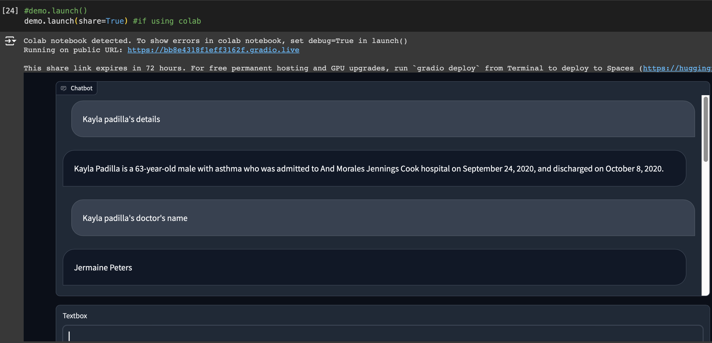
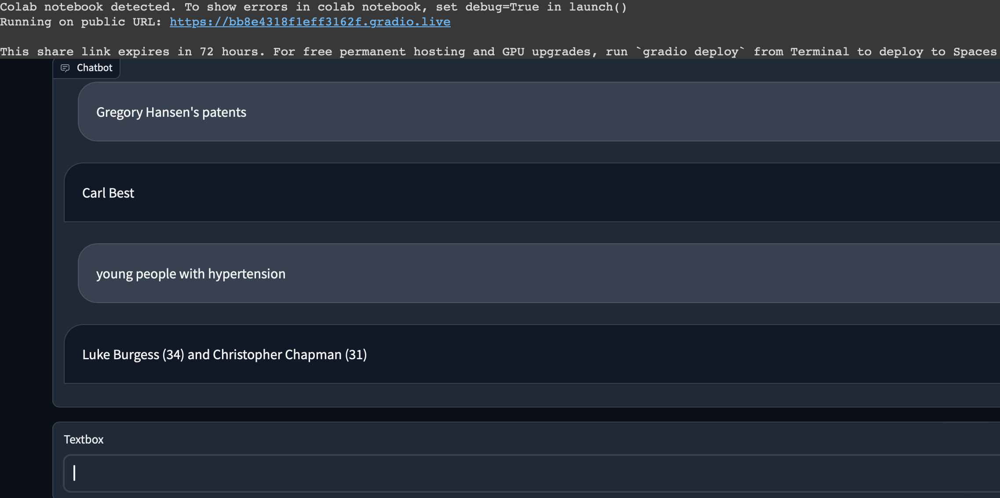
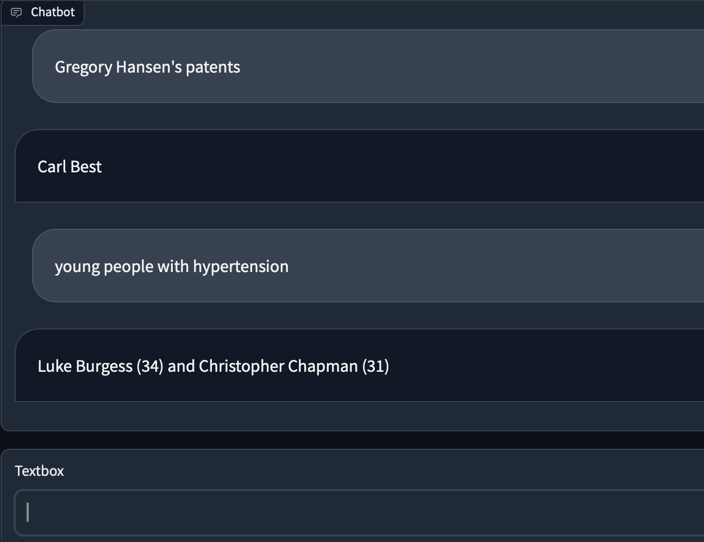
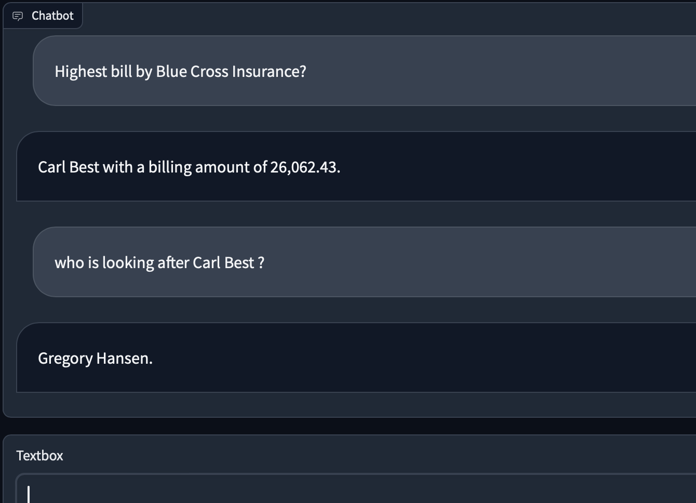

## Building Private Healthcare AI Assistant for Clinics Using Qdrant Hybrid Cloud (JWT-RBAC), DSPy and Groq — Llama3

Building a Private AI Assistant for clinics and hospitals which fetches patient data and answers questions on top of that data.

Flow Diagram :


1. ```Dataset``` : We will be working on a healthcare dataset that contains the patient’s data, including details about name, illness, medication, bills, hospital name, etc. One thing to be noted is, datasets like these are rarely available online; this dataset also is not real and is generated digitally: originally, it’s a multi-label classification dataset and can be downloaded from Kaggle here:  
[🩺Healthcare Dataset 🧪](https://www.kaggle.com/datasets/prasad22/healthcare-dataset)

2. ```DSPy``` : DSPy (or Declarative Sequencing Python framework) is a game-changing framework for algorithmically optimizing LM prompts instead of manual prompting.

3. ```Qdrant Managed Cloud``` : Qdrant is a lightweight vector database that recently started their managed cloud services, which let you use a free cluster for trial and the option to upgrade as you use more features. We will use it to store our dataset in the form of vectors.

4. ```Groq``` : Groq is building an AI accelerator application-specific integrated circuit (ASIC) which they call the Language Processing Unit (LPU) and related hardware to accelerate the inference performance of AI workloads. They provide access to the latest models like Llama3 free of cost (it’s limited), but it’s enough for our use case.


### Step by Step : 
1. Go to [qdrant](https://cloud.qdrant.io/login), Create a new account -> Create new cluster -> Create API key for usage.
2. Go to [Groq](https://groq.com/), signup -> Console key -> Create API Key for usage.

3. Set up environment :
   ```bash
   pip install qdrant-client groq sentence-transformers dspy-ai fastembed gradio --upgrade
   ```
4. Download Dataset from : [Healthcare Dataset](https://www.kaggle.com/datasets/prasad22/healthcare-dataset)

5. Code: -> [Notebook](ClinicAI.ipynb)  
   1. Read data.  
   2. Format rows into text  
   3. Generate embeddings using ```BAAI/bge-large-en-v1.5``` (Sentence Transformer) to store in a vectorDB  
   4. Use ```Qdrant``` API key to store it in the vectorDB
   5. Initialize Qdrant Client
   6. Create a Qdrant Collection
   7. Upload the Collection to the Qdrant Cloud Cluster
   8. Use ```Qdrant JWT``` by installing the ```docker``` container for Role-based Access Control
   9. Set up DSPy for programming  
   10. Initialize ```DSPy-Groq``` integration using ```Groq's``` API  
   11. Set up CoT (chain of thought) modules and signatures using ```DSPy```  
   12. Define 5 best matching points for the context  
   13. Define ```RAG``` Pipeline  
   14. Build a very simple chatbot using ```Gradio``` Framework for the UI  
   15. ```demo.launch(share = True)``` to launch the app 
   

### Tech Stack :
- ```Qdrant Managed Cloud``` : A very lightweight and secure vector database.
- ```DSPy``` : An amazing tool for programming your prompts.
- ```Groq``` : For quick LLM responses (Llama3).

### References :
- [https://qdrant.tech/](https://qdrant.tech/)
- [https://github.com/qdrant/qdrant-client](https://github.com/qdrant/qdrant-client)
- [https://www.kaggle.com/datasets/prasad22/healthcare-dataset](https://www.kaggle.com/datasets/prasad22/healthcare-dataset)
- [https://github.com/stanfordnlp/dspy](https://github.com/stanfordnlp/dspy)
- [https://console.groq.com/docs/quickstart](https://console.groq.com/docs/quickstart)

### Demo Images :




